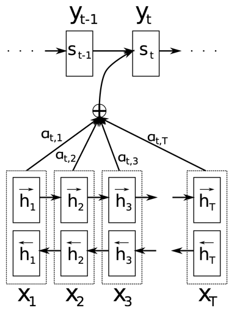

This project implements a seq2seq neural network with a Bahdanau attention mechanism.  
The architecture is composed of three components:  
Encoder: Processes the input sequence to generate a sequence of hidden states.  
Attention Mechanism: Computes a context vector dynamically based on the decoder's current state and encoder hidden states.  
Decoder: Uses the context vector to produce the next output token.  

# Encoder  
Embedding Layer: Converts input tokens into dense vectors of fixed size (embedding_dim).  
GRU Layer: processes the embedded input sequence and encodes the information into hidden states. The GRU is configured with:  
Return of both sequences and the final hidden state.  
Initialization with the GU initializer.  
Hidden State Initialization: The initial hidden state is a tensor of zeros with shape (batch_size, enc_units).  
Output:  

Sequence of hidden states with shape (batch_size, sequence_length, enc_units).  
Final hidden state with shape (batch_size, enc_units).  

# Attention Mechanism  

Dense Layers: Two fully connected layers compute a score for each encoder output.  
Score Calculation: Applies tanh to combine the decoder's hidden state with encoder outputs.  
Softmax Attention Weights: Normalized weights indicate the importance of each time step in the input sequence.  
Context Vector: A weighted sum of encoder outputs.  
  
Output:  

Context vector of shape (batch_size, hidden_size).  
Attention weights of shape (batch_size, sequence_length, 1).  

# Decoder  
Embedding Layer: Maps target tokens into dense vectors (embedding_dim).  
Attention Layer: Integrates the context vector from the encoder with the decoder's hidden state.  
GRU Layer: Processes the concatenated context vector and target embeddings to generate the decoder's output.  
Dense Layer: Maps the GRU output to the target vocabulary size to predict the next token.
  
Output:

Predicted tokens for the target sequence.
Final hidden state to be fed into the next time step.
